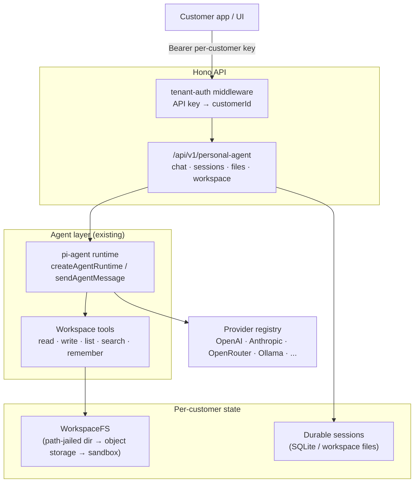

# Hosted Personal AI Agent — Architecture Proposal

## Goal

Evolve AI Backends from a shared, single-tenant AI API into a **hosted personal AI agent** product: each customer gets their own long-lived agent that remembers past conversations, works with the customer's own documents and notes, and — critically — has its **own isolated file system** that no other customer's agent can read or write.

This document covers:

1. What we can reuse from the current codebase
2. The tenancy model (customers, auth, workspaces)
3. Three options for per-customer file systems, with a recommendation
4. The agent-facing file tools and how they plug into the existing pi-agent runtime
5. Data model, security, and a phased implementation plan mapped to concrete modules

## What we already have

The hard part of an agent product — the agent loop — already exists and is reusable as-is:

| Capability | Where it lives today | Multi-tenant ready? |
|---|---|---|
| Agent loop (tools, turns, streaming, transcripts) | `src/services/pi-agent.ts` (`createAgentRuntime`, `sendAgentMessage`, `runAgent`) | Yes — runtime is created per session and takes tools/system prompt as input |
| Multi-turn chat sessions | `src/services/agent-sessions.ts` | No — in-memory `Map`, process-local, 30-min TTL, no owner attached to a session |
| Tool definitions | `src/services/agent-tools*.ts`, scenarios in `agent-scenarios.ts` | Yes — `AgentTool` is a plain object; we can construct tools closed over a customer's workspace |
| Provider abstraction (11 providers) | `src/services/ai.ts`, `registry.ts`, `pi-ai.ts` | Yes |
| Auth | `src/app.ts` (`configureAuth`) | No — one shared `DEFAULT_ACCESS_TOKEN` for the whole deployment |
| Persistence | `data/admin-config.json` via `admin-store.ts` | No — one global config file, no per-customer data |
| File handling | `src/utils/pdfExtractor.ts` (reads from arbitrary path/URL) | No — no ownership or isolation concept |

The gaps are exactly the three things a hosted product needs: **customer identity**, **durable per-customer state**, and **isolated per-customer storage**.

## Tenancy model

### Customer identity and auth

Replace the single shared bearer token with per-customer API keys:

- New `customers` entity: `{ customerId, name, email, plan, createdAt, status }`.
- Per-customer API keys, stored **hashed** (SHA-256), with `keyId` prefix for lookup — same pattern as Stripe/OpenAI keys (`pk_live_...`). A customer can hold several keys and revoke them individually.
- New middleware `src/middlewares/tenant-auth.ts`: resolves `Authorization: Bearer <key>` → `customerId`, rejects unknown/revoked keys, and sets `c.set('customerId', ...)` on the Hono context. Everything downstream (routes, services, tools) receives the tenant from context — never from the request body.
- Keep `DEFAULT_ACCESS_TOKEN` as an **admin/operator** token only (admin routes, provisioning customers).

### The customer workspace

Every customer gets one **workspace** — the unit of isolation. A workspace bundles:

- A private file system root (see next section)
- Persisted agent sessions and transcripts
- Agent configuration (system prompt / persona, enabled tools, default provider+model)
- Long-term memory (agent-maintained notes, e.g. a `memory/` directory inside their file system)
- Usage counters (tokens, storage bytes) for quotas and billing

```
Workspace (1 per customer)
├── Files          — isolated FS root, agent + customer both read/write
├── Sessions       — durable conversation transcripts
├── Agent config   — persona, tools, model preferences
└── Usage          — token + storage accounting
```

## Per-customer file system: three options

The key architectural decision. All three share the same agent-facing tool interface (below), so we can start simple and upgrade the backend without changing the agent.

### Option A — Directory-per-customer on a shared volume (path jail)

Each customer gets `${WORKSPACES_ROOT}/<customerId>/` on a persistent volume (Fly volume / Docker bind mount). A `WorkspaceFS` service enforces a **path jail**: every path coming from the model or the API is resolved with `path.resolve` against the customer root and rejected if the result escapes it (guards `../`, absolute paths, and symlink escape via `fs.realpath` checks).

```
/data/workspaces/
├── cus_a1b2c3/
│   ├── documents/contract.pdf
│   ├── notes/meeting-2026-08-10.md
│   └── memory/preferences.md
└── cus_d4e5f6/
    └── ...
```

- **Isolation:** logical only (application-enforced). One kernel, one process. A path-handling bug is a cross-tenant leak, so the jail must be a single choke point with heavy test coverage.
- **Pros:** smallest change; real POSIX semantics; works with today's single-node Bun/Fly deployment; `pdfExtractor` works unmodified on jailed paths.
- **Cons:** doesn't scale past one node (volume is machine-local); quota enforcement is manual; not safe if the agent ever executes code/shell.

### Option B — Object storage-backed virtual file system

Files live in S3/R2/Tigris under a per-customer prefix (`workspaces/<customerId>/...`), with a metadata index (SQLite/Postgres) for listings, search, and quota accounting. `WorkspaceFS` becomes an adapter over object storage.

- **Isolation:** enforced both in the app layer and, optionally, with per-tenant scoped credentials (STS-style prefix-scoped tokens), so even an app bug can't cross prefixes.
- **Pros:** horizontally scalable (any app node serves any customer — pairs with moving sessions to a DB); durable, versioned, encrypted at rest by default; trivially supports many thousands of tenants; cheap.
- **Cons:** no POSIX semantics (no partial writes/appends without read-modify-write); listing/search needs the metadata index; slightly higher latency per file op.

### Option C — Sandbox-per-customer (microVM / container)

Each customer's agent runs in its own Fly Machine / Firecracker microVM / gVisor container with an attached private volume. The API layer becomes a router that wakes the customer's machine and proxies chat to it.

- **Isolation:** kernel-level — the strongest. The file system is *actually* separate, not logically separated.
- **Pros:** required if the agent gets `run_shell` / code-execution tools (this is the model used by hosted coding agents); per-customer CPU/memory limits for free; a compromised agent can only hurt its own sandbox.
- **Cons:** biggest lift — machine lifecycle management (create/wake/sleep/destroy), cold starts, per-tenant cost floor, fleet upgrades. Overkill while the agent only does read/write-file + LLM calls.

### Recommendation

**Start with A, design the interface for B, adopt C only when the agent needs code execution.**

Concretely: build the `WorkspaceFS` interface now and ship Option A behind it (one env var, one volume, fastest to market). The interface is deliberately object-storage-shaped (whole-file read/write, no seek/append), so migrating to Option B is a new adapter plus a data copy — no changes to tools, routes, or schemas. Option C becomes the "Pro" tier when we add shell/code tools; even then, B remains the durable store and the sandbox is hydrated from it.

### Chat + file creation does NOT require sandboxes

A common concern: "customers chat with the agent and it creates files — do we need always-on sandboxes for that?" No. When the agent "creates a file," nothing executes on customer-owned compute. The model emits a `write_file` tool call and the shared API process handles it as an ordinary library call: validate the path, write into the customer's jail (A) or object-storage prefix (B). Chat plus file CRUD is fully served by the shared, stateless API tier — one fleet of nodes serves every customer, and an idle customer costs nothing beyond stored bytes.

Sandboxes are needed only when the agent must **execute** something (`run_shell`, Python, `npm install`). Even then, "always-on" is the last resort, not the default:

| Pattern | How it works | When to use |
|---|---|---|
| **Just-in-time, scale-to-zero** | Sandbox is created/woken only while an exec tool call runs: hydrate workspace from `WorkspaceFS`, execute, sync results back, stop the machine. Fly Machines wake in well under a second; Firecracker microVMs cold-boot in ~150ms. | Default once exec tools exist — this is how hosted coding agents operate |
| **Ephemeral per-task sandboxes** | No per-customer machine at all: take a blank sandbox from a warm pool, hydrate, run, write outputs back, destroy. | Same as above, with even less fleet management; requires Option B as source of truth |
| **Always-on machine** | Dedicated, persistently running per-customer VM. | Only for persistent background workloads (cron-like agents, watchers) — a premium tier with a per-customer cost floor |

The architectural move that makes this cheap is keeping **durable state out of the sandbox**: files live in `WorkspaceFS`, transcripts in the session store. The sandbox is pure scratch compute — safe to kill anytime, recreated on demand.

## Agent-facing file tools

New module `src/services/agent-tools-workspace.ts`. Tools are constructed **per session**, closed over the authenticated customer's `WorkspaceFS` — the model never supplies a customer id:

```ts
export function createWorkspaceTools(fs: WorkspaceFS): AgentTool<any>[] {
  return [
    listFilesTool(fs),    // list_files(path?) -> tree listing
    readFileTool(fs),     // read_file(path) -> text (PDF routed via pdfExtractor)
    writeFileTool(fs),    // write_file(path, content) -> creates parent dirs
    deleteFileTool(fs),   // delete_file(path)
    searchFilesTool(fs),  // search_files(query) -> matching paths + snippets
    rememberTool(fs),     // remember(note) -> appends to memory/notes.md
  ];
}
```

And the `WorkspaceFS` interface every backend option implements:

```ts
export interface WorkspaceFS {
  readonly customerId: string;
  list(prefix?: string): Promise<FileEntry[]>;
  read(path: string): Promise<Buffer>;
  write(path: string, data: Buffer): Promise<void>;   // enforces quota
  delete(path: string): Promise<void>;
  stat(path: string): Promise<FileEntry | null>;
  usage(): Promise<{ bytes: number; files: number }>;  // for quotas/billing
}
```

Session creation changes from scenario-selected tools to workspace-scoped tools:

```ts
// in the personal-agent route handler
const customerId = c.get('customerId');
const fs = await openWorkspaceFS(customerId);
const runtime = createAgentRuntime({
  provider, model,
  systemPrompt: workspace.persona ?? PERSONAL_AGENT_PROMPT,
  tools: [...createWorkspaceTools(fs), ...standardTools],
});
```

`createAgentRuntime` needs one small extension: accept an explicit `tools` array in addition to a scenario key. Nothing else in `pi-agent.ts` changes.

## Durable sessions

In-memory sessions (`agent-sessions.ts`) don't survive restarts and can't be shared across nodes. For a personal agent, the conversation *is* the product, so transcripts must persist:

- Store transcripts as JSON per session — in SQLite (`data/agent.db` via `bun:sqlite`, zero new infra) keyed by `(customerId, sessionId)`, or as files inside the workspace (`.sessions/<sessionId>.json`) so option B/C get durability for free.
- Keep the current in-memory `Map` as a **hot cache** of live runtimes; on cache miss, rehydrate the pi Agent from the stored transcript (pi-agent-core agents accept initial messages).
- Every session lookup filters by `customerId` — a session id alone must never grant access.

## API surface

New route `src/routes/v1/personal-agent.ts` (mounted at `/api/v1/personal-agent`), following existing conventions:

| Endpoint | Purpose |
|---|---|
| `POST /chat` | Message the customer's agent (SSE streaming, same event shape as today's `/agent/chat`) |
| `GET /sessions`, `GET/DELETE /sessions/:id` | List/inspect/delete own sessions |
| `GET /files`, `GET /files/*path` | Browse/download workspace files |
| `PUT /files/*path`, `DELETE /files/*path` | Upload (multipart)/delete files — how customers feed documents to their agent |
| `GET /workspace` | Workspace info: persona, usage, quota |
| `PATCH /workspace` | Update persona / default model |

All of these sit behind the tenant-auth middleware; the customer id comes exclusively from the API key.

## Security checklist

- **Path jail as a single choke point** (Option A): normalize + `resolve` + `realpath` containment check in one function; property-test it with traversal payloads (`../`, encoded, symlinks, NUL bytes).
- **Tenant id from auth context only** — never from body, query, or model output.
- **Quotas:** per-customer storage cap (checked in `WorkspaceFS.write`), max file size, max files; per-customer rate limits and token budgets on chat.
- **Key hygiene:** API keys hashed at rest, prefix-searchable, revocable; admin token separated from customer keys.
- **Tool output hygiene:** file contents fed to the model are untrusted (prompt-injection surface). Cap tool result sizes; never let file content alter which tenant's tools run.
- **Encryption at rest:** free with Option B; use volume encryption for Option A.
- **No code-execution tools** until Option C isolation exists.

## Target architecture



## Phased plan

**Phase 1 — Tenancy foundation.** `src/models/customer.ts`, customer + API-key store (SQLite), `src/middlewares/tenant-auth.ts`, admin endpoints to provision customers. Invasiveness: additive; only `app.ts` auth wiring changes.

**Phase 2 — Workspace FS (Option A).** `src/services/workspace-fs.ts` (interface + local adapter with path jail + quotas), `WORKSPACES_ROOT` config, `/files` routes, unit tests for the jail. Additive.

**Phase 3 — Personal agent.** `agent-tools-workspace.ts`, `tools` parameter on `createAgentRuntime`, `personal-agent` route with SSE chat, durable sessions keyed by customer. Touches `pi-agent.ts` (small) and reuses the session/streaming patterns from the existing agent routes.

**Phase 4 — Scale-out (when needed).** Object-storage `WorkspaceFS` adapter (Option B) + sessions in Postgres → multiple app nodes on Fly. No tool/route changes.

**Phase 5 — Sandboxes (when code execution is wanted).** Fly Machines per customer (Option C), `run_shell`/code tools available only inside the sandbox, object storage remains the durable file store.

The main risks are concentrated in two places: the path-jail correctness in Phase 2 (mitigated by making it one small, heavily tested function) and session rehydration fidelity in Phase 3 (mitigated by storing the full pi transcript verbatim).
